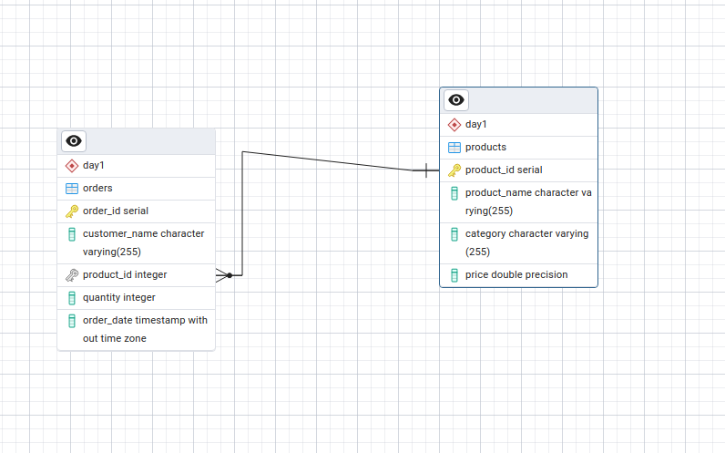
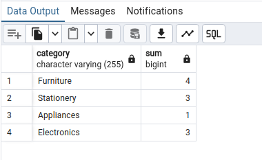
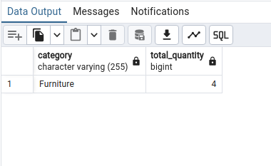

# DBMS Assignment 1

## here is ER Diagram



# Table creation, insertion

```sh

create table products(
	product_id serial primary key,
	product_name varchar(255),
	category varchar(255),
	price float
);


-- Inserting  data into products table
INSERT INTO products (product_name, category, price)
VALUES
('Laptop', 'Electronics', 999.99),
('Smartphone', 'Electronics', 699.99),
('Desk Chair', 'Furniture', 149.99),
('Book', 'Stationery', 19.99),
('Coffee Maker', 'Appliances', 89.99);


create table orders (
	order_id serial primary key,
	customer_name varchar(255),
	product_id int,
	foreign key(product_id) references products(product_id),
	quantity int,
	order_date timestamp
);

-- Inserting  data into orders table
INSERT INTO orders (customer_name, product_id, quantity, order_date)
VALUES
('Alice Johnson', 1, 2, '2024-07-01 10:30:00'),
('Bob Smith', 2, 1, '2024-07-01 11:00:00'),
('Charlie Brown', 3, 4, '2024-07-02 09:15:00'),
('Diana Prince', 4, 3, '2024-07-02 12:45:00'),
('Eve Adams', 5, 1, '2024-07-03 14:30:00');

```

# Query

```sh
-- Calculate the total quantity ordered for each product category in the orders table.

select p.category, sum(o.quantity) from products p join orders o on p.product_id = o.product_id group by p.category;

```
# Output



```sh

-- Find categories where the total number of products ordered is greater than 3.

select p.category, sum(o.quantity) as total_quantity from products p join orders o 
on p.product_id = o.product_id group by p.category having sum(o.quantity) > 3;

```


# Output

