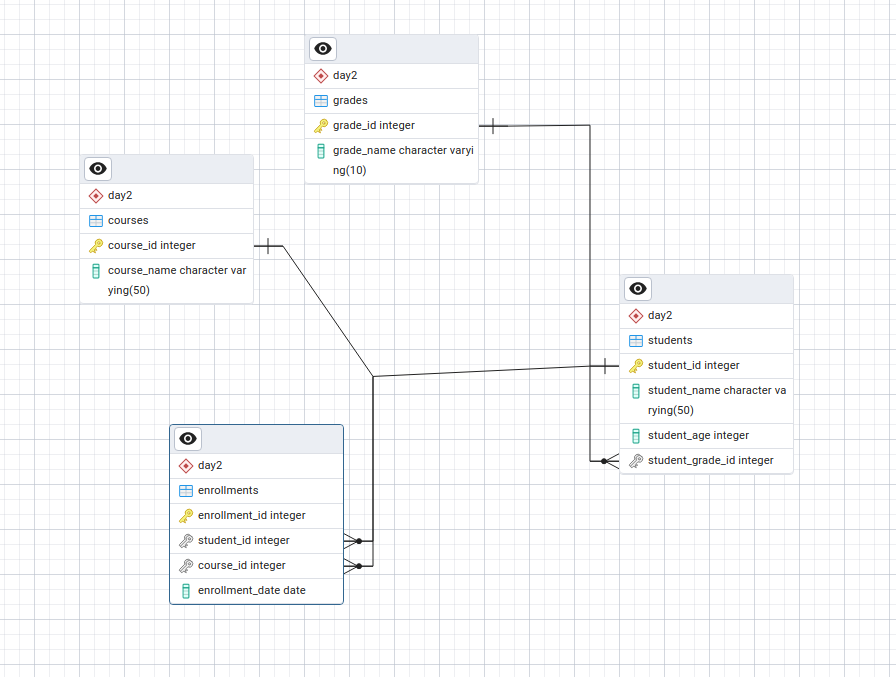
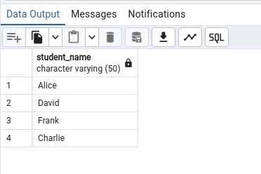
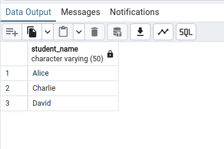
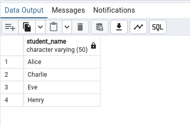
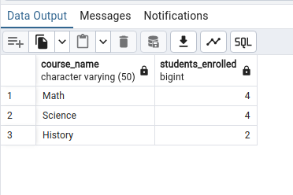
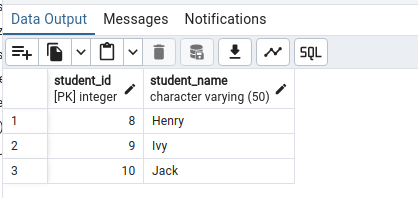
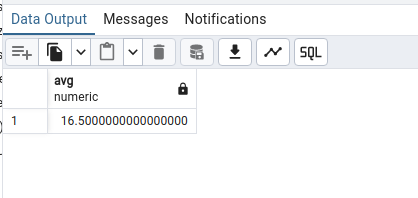
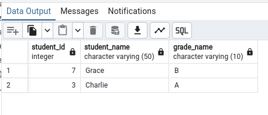

# DBMS Assignment 1

## here is the ER Diagram



# Table creation, insertion

```sh

CREATE TABLE Grades (
    grade_id INT PRIMARY KEY,
    grade_name VARCHAR(10)
);

CREATE TABLE Students (
    student_id INT PRIMARY KEY,
    student_name VARCHAR(50),
    student_age INT,
    student_grade_id INT,
    FOREIGN KEY (student_grade_id) REFERENCES Grades(grade_id)
);

CREATE TABLE Courses (
    course_id INT PRIMARY KEY,
    course_name VARCHAR(50)
);

CREATE TABLE Enrollments (
    enrollment_id INT PRIMARY KEY,
    student_id INT,
    course_id INT,
    enrollment_date DATE,
    FOREIGN KEY (student_id) REFERENCES Students(student_id),
    FOREIGN KEY (course_id) REFERENCES Courses(course_id)
);

INSERT INTO Grades (grade_id, grade_name) VALUES
(1, 'A'),
(2, 'B'),
(3, 'C');

INSERT INTO Courses (course_id, course_name) VALUES
(101, 'Math'),
(102, 'Science'),
(103, 'History');

INSERT INTO Students (student_id, student_name, student_age, student_grade_id) VALUES
(1, 'Alice', 17, 1),
(2, 'Bob', 16, 2),
(3, 'Charlie', 18, 1),
(4, 'David', 16, 2),
(5, 'Eve', 17, 1),
(6, 'Frank', 18, 3),
(7, 'Grace', 17, 2),
(8, 'Henry', 16, 1),
(9, 'Ivy', 18, 2),
(10, 'Jack', 17, 3);

INSERT INTO Enrollments (enrollment_id, student_id, course_id, enrollment_date) VALUES
(1, 1, 101, '2023-09-01'),
(2, 1, 102, '2023-09-01'),
(3, 2, 102, '2023-09-01'),
(4, 3, 101, '2023-09-01'),
(5, 3, 103, '2023-09-01'),
(6, 4, 101, '2023-09-01'),
(7, 4, 102, '2023-09-01'),
(8, 5, 102, '2023-09-01'),
(9, 6, 101, '2023-09-01'),
(10, 7, 103, '2023-09-01');

```

# Query

```sh

--(1) Find all students enrolled in the Math course.

 select student_name from Students where student_id in (
	select student_id from Enrollments where course_id in (
	select course_id from Courses where course_name = 'Math'
	)
  );

```

# Output




```sh

--(2) List all courses taken by students named Bob.

select course_name from Courses where course_id in (
select course_id from Enrollments where student_id in (
select student_id from Students where student_name = 'Bob'
)
);

```

# Output


```sh

--(3) Find the names of students who are enrolled in more than one course.

select student_name from Students where student_id in (
select student_id from Enrollments  group by student_id having count(student_id) > 1
);

```

# Output




```sh

-- (4) List all students who are in Grade A (grade_id = 1)

select student_name from Students where student_grade_id in (
select grade_id from Grades where grade_name = 'A'
);

```

# Output




```sh

-- (5) Find the number of students enrolled in each course.

SELECT c.course_name,(SELECT COUNT(*) FROM Enrollments e 
WHERE e.course_id = c.course_id) AS students_enrolled
FROM Courses c;

```

# Output




```sh

-- (6) Retrieve the course with the highest number of enrollments.

SELECT course_name FROM  Courses WHERE course_id = (
SELECT course_id FROM Enrollments GROUP BY course_id ORDER BY COUNT(student_id) DESC LIMIT 1
);


```


# Output


```sh

-- (7) List students who are enrolled in all available courses.

SELECT s.student_id, s.student_name FROM Students s WHERE 
(SELECT COUNT(e.course_id)
FROM Enrollments e WHERE e.student_id = s.student_id) = (SELECT COUNT(*) FROM Courses);

```


# Output


```sh

-- (8) Find students who are not enrolled in any courses.

SELECT student_id, student_name FROM Students WHERE student_id NOT IN 
(SELECT DISTINCT student_id FROM Enrollments
);

```

# Output




```sh

-- (9) Retrieve the average age of students enrolled in the Science course.

select avg(student_age) from Students where student_id in (
	select student_id from Enrollments  where course_id in (
	select course_id from Courses where course_name = 'Science'
	)
);

```

# Output



```sh

-- (10) Find the grade of students enrolled in the History course.

SELECT s.student_id, s.student_name, g.grade_name FROM Students s
JOIN Grades g ON s.student_grade_id = g.grade_id
WHERE s.student_id IN (
SELECT e.student_id FROM Enrollments e JOIN Courses c ON e.course_id = c.course_id WHERE 
c.course_name = 'History'
);

```

# Output



