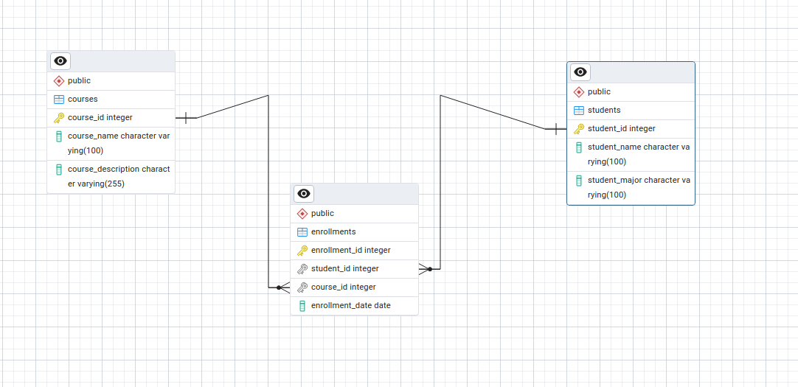
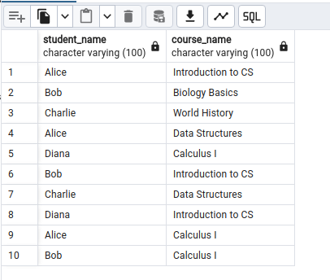
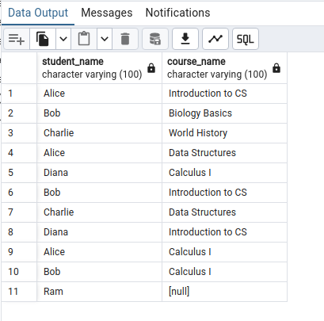
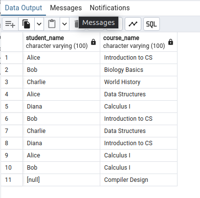
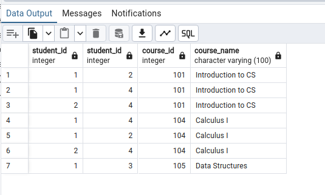
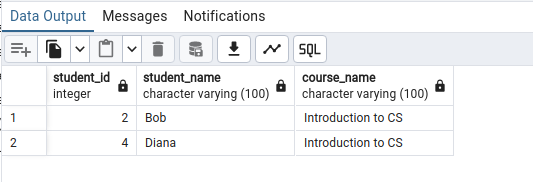
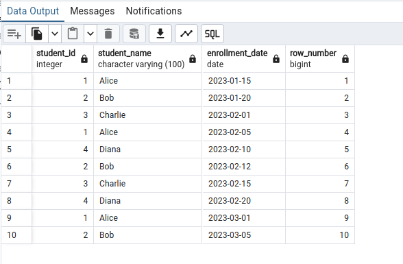
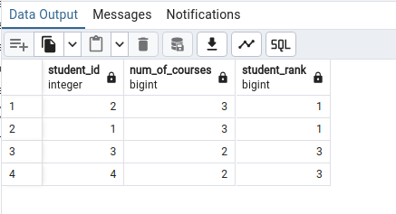
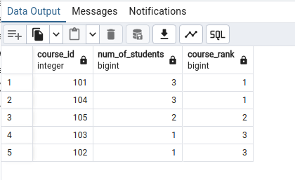

# DBMS Assignment 3
## here is ER Diagram


# Table creation, insertion
```sh
-- Create Students table
CREATE TABLE Students (
    student_id INT PRIMARY KEY,
    student_name VARCHAR(100),
    student_major VARCHAR(100)
);

-- Create Courses table
CREATE TABLE Courses (
    course_id INT PRIMARY KEY,
    course_name VARCHAR(100),
    course_description VARCHAR(255)
);

-- Create Enrollments table
CREATE TABLE Enrollments (
    enrollment_id INT PRIMARY KEY,
    student_id INT,
    course_id INT,
    enrollment_date DATE,
    FOREIGN KEY (student_id) REFERENCES Students(student_id),
    FOREIGN KEY (course_id) REFERENCES Courses(course_id)
);

-- Insert data into Students table
INSERT INTO Students (student_id, student_name, student_major) VALUES
(1, 'Alice', 'Computer Science'),
(2, 'Bob', 'Biology'),
(3, 'Charlie', 'History'),
(4, 'Diana', 'Mathematics');

insert into Students values(5, 'Ram', 'Nepali');

-- Insert data into Courses table
INSERT INTO Courses (course_id, course_name, course_description) VALUES
(101, 'Introduction to CS', 'Basics of Computer Science'),
(102, 'Biology Basics', 'Fundamentals of Biology'),
(103, 'World History', 'Historical events and cultures'),
(104, 'Calculus I', 'Introduction to Calculus'),
(105, 'Data Structures', 'Advanced topics in CS');

insert into Courses values (106, 'Compiler Design', 'Related to programming');

-- Insert data into Enrollments table
INSERT INTO Enrollments (enrollment_id, student_id, course_id, enrollment_date) VALUES
(1, 1, 101, '2023-01-15'),
(2, 2, 102, '2023-01-20'),
(3, 3, 103, '2023-02-01'),
(4, 1, 105, '2023-02-05'),
(5, 4, 104, '2023-02-10'),
(6, 2, 101, '2023-02-12'),
(7, 3, 105, '2023-02-15'),
(8, 4, 101, '2023-02-20'),
(9, 1, 104, '2023-03-01'),
(10, 2, 104, '2023-03-05');

```
# Query with output

```sh

-- (1) Retrieve the list of students and their enrolled courses.

select s.student_name, c.course_name from Students s 
join Enrollments e on s.student_id = e.student_id 
join Courses c on c.course_id = e.course_id;

```
## Output



```sh

-- (2) List all students and their enrolled courses, including those who haven't enrolled in any course.

select s.student_name, c.course_name from Students s 
left join Enrollments e on s.student_id = e.student_id 
left join Courses c on c.course_id = e.course_id;

```
## Output



```sh

-- (3) Display all courses and the students enrolled in each course, including courses with no enrolled students.

select s.student_name, c.course_name from Students s 
right join Enrollments e on s.student_id = e.student_id 
right join Courses c on c.course_id = e.course_id;

```

## Output




```sh

-- (4) Find pairs of students who are enrolled in at least one common course.

select en1.student_id, en2.student_id, en1.course_id, c.course_name from Enrollments en1 
join Enrollments en2 on en1.course_id = en2.course_id 
join Courses c on c.course_id = en1.course_id
where en1.student_id < en2.student_id;

```

## Output



```sh

-- (5) Retrieve students who are enrolled in 'Introduction to CS' but not in 'Data Structures'.

select s.student_id, s.student_name, c.course_name from Students s 
join Enrollments e on s.student_id = e.student_id 
join Courses c on c.course_id = e.course_id
where c.course_name = 'Introduction to CS' and s.student_id not in (
	select en1.student_id from Enrollments en1 
	join Courses c2 on en1.course_id = c2.course_id 
	where c2.course_name = 'Data Structures'
);

```


## Output



```sh

-- (6) List all students along with a row number based on their enrollment date in ascending order.

select s.student_id, s.student_name, en.enrollment_date,
row_number() over(order by en.enrollment_date asc)
from Students s
join Enrollments en on s.student_id = en.student_id;

```
## Output



```sh

-- (7) Rank students based on the number of courses they are enrolled in, handling ties by assigning the same rank.

select e.student_id, count(e.student_id) as Num_of_courses, 
rank() over (order by count(e.student_id) desc) as Student_Rank 
from Students s 
join Enrollments e on s.student_id = e.student_id group by e.student_id;

```

## Output




```sh

-- (8) Determine the dense rank of courses based on their enrollment count across all students

select e.course_id, count(e.student_id) as Num_of_students, 
dense_rank() over (order by count(e.course_id) desc) as Course_rank 
from Students s 
join Enrollments e on s.student_id = e.student_id group by e.course_id;

```


## Output

