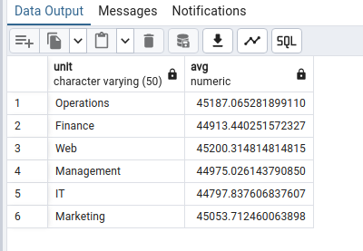
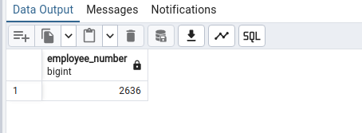
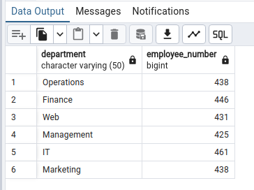
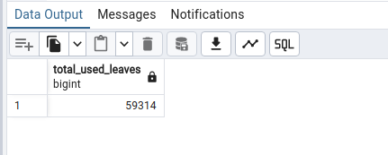
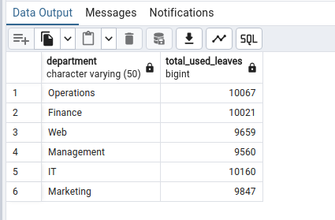

# DBMS Assignment 4

## Table creation

```sh

-- Table creation
create table Profession (
	firstName varchar(50),
	lastName varchar(50),
	sex varchar(50),
	doj date,
	currentDate date,
	designation varchar(50),
	age int,
	salary int,
	unit varchar(50),
	leavesUsed int,
	leavesRemaining int,
	ratings float,
	pastExp float
);

```

## Query

```sh

-- (1) Calculate the average salary by department for all Analysts.

with
avg_sal_of_analyst_by_department as(
   select p.unit, avg(p.salary) from Profession p 
   where p.designation = 'Analyst' group by p.unit
)
select * from avg_sal_of_analyst_by_department;

```

## Output




```sh

-- (2) List all employees who have used more than 10 leaves.

with
emp_who_used_leave_more_than_ten as (
  	select firstname, lastname from Profession where leavesUsed > 10
)
select count(*) from emp_who_used_leave_more_than_ten;

```

## Output




```sh

-- (3) Create a view to show the details of all Senior Analysts.

create view details_of_senior_analystes as 
select * from Profession where designation = 'Senior Analyst';

select * from details_of_senior_analystes;

```

## Output


```sh

-- (4) Create a materialized view to store the count of employees by department.
create materialized view num_of_emp_by_department as 
select unit as Department, count(firstname) as Employee_Number from Profession group by unit;

select * from num_of_emp_by_department;

```

## Output




```sh

-- (5) Create a procedure to update an employee's salary by their first name and last name.
create or replace procedure updateEmployee(
	in firstN varchar, 
	in lastN varchar, 
	in amount float
)
language plpgsql
as $$
begin
	update profession 
	set salary = salary + amount
	where firstname = firstN and lastname = lastN;
end;$$;

call updateEmployee('TOMASA', 'ARMEN', -600);

```

```sh

-- (6) Create a procedure to calculate the total number of leaves used across all departments.
create or replace procedure totalUsedLeaves()
language plpgsql
as $$
begin
	create view getTotalUsedLeaves as
	select sum(leavesused) as Total_Used_Leaves from Profession;
end;$$;

call totalUsedLeaves();

select * from getTotalUsedLeaves;

```


## Output



```sh


-- (7) Create a procedure to calculate the total number of leaves used departments wise.
create or replace procedure totalUsedLeavesDepartmentWise()
language plpgsql
as $$
begin
	create view getTotalUsedLeavesDepartmentWise as
	select unit as Department, sum(leavesused) as Total_Used_Leaves from Profession group by unit;
end;$$;

call totalUsedLeavesDepartmentWise();
select * from getTotalUsedLeavesDepartmentWise;

```


## Output




